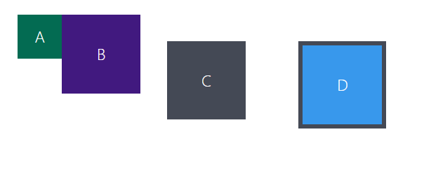

# Box Model - Modelo de caixas no CSS

Primeiro veja o layout de caixas abaixo

- Vamos reproduzir esse esquema de itens no seu browser! Copie os códigos abaixo e cole-os no seu VS Code, criando um arquivo `index.html` e um arquivo `style.css`.