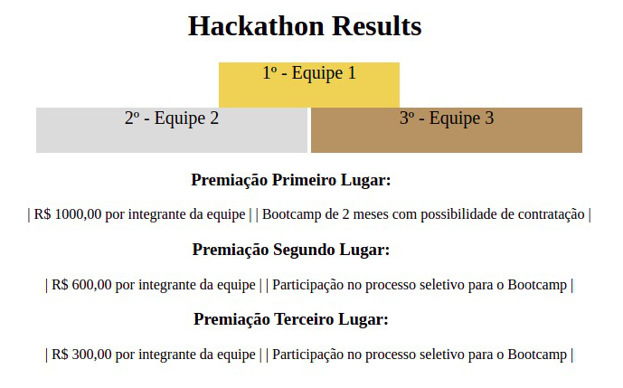

Para realizar este exercício faça a implementação das propriedades CSS e, se necessário, faça adições à estrutura HTML, para que o resultado final seja similar à imagem referência.

Lembre-se que a estrutura da página deve ser mantida para que a semântica do código seja preservada.